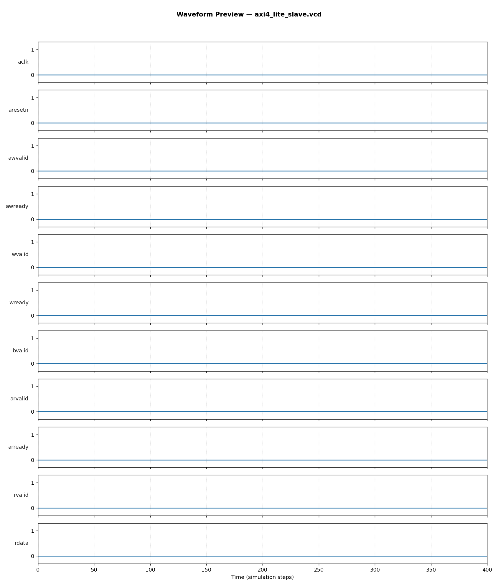

# AXI4-Lite Slave Controller — RTL Design & Verification

**Author:** Abhijit Karale
**Tools used:** SystemVerilog (IEEE 1800-2012), Icarus Verilog 12.0, Python/Matplotlib

## Overview
An AXI4-Lite slave with 8 memory-mapped 32-bit registers, implementing all
5 independent AXI4-Lite channels (write-address, write-data, write-response,
read-address, read-data) as separate handshaking FSMs — the standard
register-access interconnect protocol used throughout modern ARM-based SoCs
for connecting peripherals and IP blocks to the system interconnect/NoC.

- **Registers:** 8 x 32-bit, word-addressed
- **Write path:** independent AW/W channels converging into a shared write FSM, with per-byte `WSTRB` support
- **Read path:** independent AR/R channel FSM
- **Error response:** `SLVERR` (`2'b10`) correctly returned on out-of-range address access on both read and write paths

## Block Diagram
```
 AWADDR/AWVALID ──▶┌─────────────┐
 WDATA/WSTRB/WVALID─▶│ Write FSM   │──▶ BRESP/BVALID
                     │ (AW→W→B)    │
                     └──────┬──────┘
                            ▼
                    ┌───────────────┐
                    │  8x32-bit Regs │
                    └───────┬───────┘
                            ▲
 ARADDR/ARVALID ──▶┌────────┴────┐
                    │ Read FSM    │──▶ RDATA/RRESP/RVALID
                    │ (AR→R)      │
                    └─────────────┘
```

## Verification Approach
Self-checking SystemVerilog testbench (`tb/tb_axi4_lite_slave.sv`) with:
- **Reference model:** shadow register array mirroring expected register contents
- **Directed tests:** write-then-read-back all 8 registers; out-of-range read returns SLVERR
- **Constrained-random regression:** 100 randomized write/read transactions across all registers
- **Result: 109/109 checks passed, 0 failures**

## Waveform


Full interactive waveform: `waveform/axi4_lite_slave.vcd` (open with GTKWave or any VCD viewer)

## How to Run
```bash
chmod +x run.sh
./run.sh
```
Requires: `iverilog`, `vvp` (Icarus Verilog), Python 3 with `matplotlib`.

## Repository Structure
```
04_axi4_lite_slave/
├── rtl/axi4_lite_slave.sv        # synthesizable RTL (5-channel AXI4-Lite FSMs)
├── tb/tb_axi4_lite_slave.sv      # self-checking testbench
├── waveform/                     # VCD + PNG waveform preview
├── vcd_plot.py                   # waveform plotting utility
└── run.sh                        # one-command build+sim+plot
```

## Skills Demonstrated
`SystemVerilog` `AXI4-Lite Protocol` `RTL Design` `Functional Verification`
`Constrained-Random Testing` `Multi-Channel Handshake Protocols` `SoC Interconnect`
